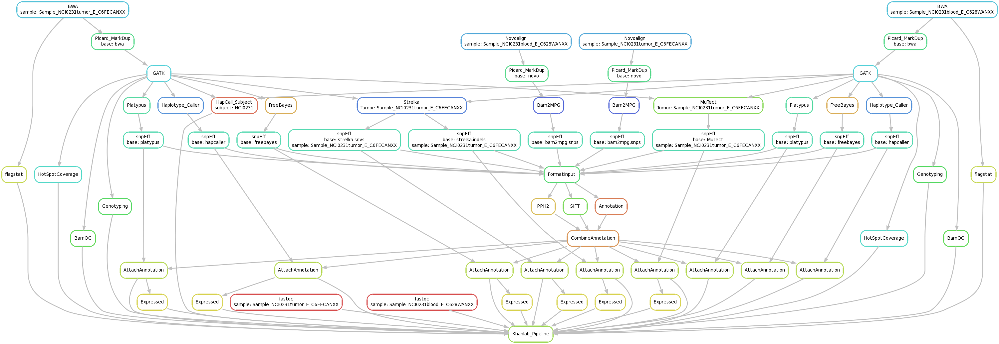

## Introduction
This is the implimentation of KhanLab NGS Pipeline using Snakemake.
## Installation

The easiest way to get serpentine is to clone the repository.

```
git clone https://github.com/patidarr/ngs_pipeline.git
```
## Conventions

- Sample names cannot have "/" or "." in them
- fastq files end in ".fastq.gz"
- fastq files are stored on biowulf @ /data/khanlab/projects/DATA/
- Corresponding RNASeq file is stored @ /data/khanlab/projects/working_DATA/{SAMPLE}/{SAMPLE}.Processed/{SAMPLE}.bam


Rulegraph


DAG for example Sample

